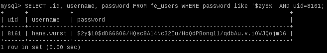

.. ==================================================
.. FOR YOUR INFORMATION
.. --------------------------------------------------
.. -*- coding: utf-8 -*- with BOM.

.. include:: ../Includes.txt

.. _introduction:

Introduction
============

.. _what-it-does:

What does it do?
----------------

User password data is being stored in the database as salted hashes by the system extension :ref:`saltedpasswords <saltedpasswords:start>`. It provides three
salting methods. This extension adds the php 5.3.7 blowfish crypt salting method for password hashing. This may be useful when importing password hashes from
other software that uses php crypt (like Admidio).

Salted passwords provides three hashing methods:

* Portable PHP password hashing
* MD5 salted hashing

  salt $1$[salt 6 chars]$

* Blowfish salted hashing using php(<5.3.7) crypt

  salt $2a$[cost 2 chars]$[salt 22 chars]

Extrasalt adds

* Blowfish salted hashing using php(>5.3.7) crypt

  salt $2y$[cost 2 chars]$[salt 22 chars]

  introduced in php 5.3.7 as described on http://www.php.net/security/crypt_blowfish.php

.. _screenshots:

Screenshots
-----------

   Example user data.

Motivation and History
----------------------

Importing password userdata (using extension :ref:`external import <external_import:start>`) from `Admidio <https://www.admidio.org/>`_ stopped working for me at some point of time.
I tried to figure out what went wrong and put the results of my examination into this extension which works for my specific case. 
If it's useful for anyone else, feel free to use at your own risk.
